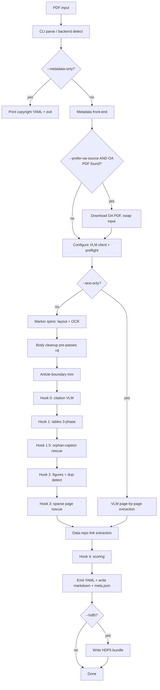

# paper2md Pipeline Workflow Reference

This document describes the end-to-end workflow of `src/paper2md.py`
(v0.4.0) in enough structural detail to drive a flowchart-rendering
tool (the intended downstream is a PowerPoint flowchart generator).
It is organised in three layers of zoom:

1. **High-level overview** — the major stages, with input/output
   shape between each.
2. **Stage-by-stage detail** — what each stage does, decision
   points, branches, side effects, and code locations.
3. **Cross-cutting concerns** — concurrency model, external
   dependencies, and the principal mode flags that change the
   pipeline shape.

A diagram-rendering LLM should treat each `### Stage` heading as a
named node, decision points as diamonds, and sub-bullets as the
text that goes inside each shape. ASCII art and Mermaid blocks are
provided as starting points but should be redrawn for the target
medium.

---

## 1. High-level overview

The pipeline is **a metadata pre-pass, a GPU spine, eight
deterministic body cleanup passes, five VLM hooks, two
deterministic post-passes, a heuristic scoring pass, and an output
writer**. Input is a PDF (or a folder of PDFs in batch mode);
output is a markdown file plus an `assets/` folder containing
JPEGs and per-table sidecar `.md` files, with a multi-block YAML
front-matter summarising provenance, plus a `.meta.json` sidecar.

```
                         ┌─────────────────┐
   PDF ──────────────────│  CLI / argparse │
                         │   parse, env,   │
                         │ backend detect  │
                         └────────┬────────┘
                                  │
                                  ▼
                         ┌─────────────────┐
                         │   Metadata      │     network: OpenAlex,
                         │   front-end     │←─── Unpaywall, EuropePMC,
                         │ (--metadata-only│     OSTI, arXiv, Crossref
                         │   exits here)   │
                         └────────┬────────┘
                                  │ (optional swap PDF → OA copy)
                                  ▼
                         ┌─────────────────┐
                         │ VLM client      │←─── env: VLM_PROVIDER,
                         │ configure +     │     VLM_MODEL, VLLM_BASE_URL,
                         │ preflight ping  │     OPENAI_API_KEY, …
                         └────────┬────────┘
                                  │
                                  ▼
                         ┌─────────────────┐
                         │  Marker spine   │←─── GPU: surya layout,
                         │ (--text-only    │     surya OCR, math
                         │  bypasses this) │     recognition
                         └────────┬────────┘
                                  │ raw markdown + extracted images
                                  ▼
                         ┌─────────────────┐
                         │ Body cleanup    │     no VLM, no GPU
                         │ pre-passes (8)  │     line-numbers / running-footers
                         │                 │     / page-headers / math-labels
                         │                 │     / span-anchored refs / ref-
                         │                 │     numbering / footnote-
                         │                 │     consolidation / merge-refs
                         └────────┬────────┘
                                  ▼
                         ┌─────────────────┐
                         │ Article-trim    │     1–log₂(N) VLM calls
                         │ (concatenated   │
                         │  PDFs)          │
                         └────────┬────────┘
                                  ▼
                         ┌─────────────────┐
                         │  VLM hook 0     │     1 VLM call
                         │  citation       │
                         └────────┬────────┘
                                  ▼
                         ┌─────────────────┐
                         │  VLM hook 1     │     N concurrent VLM calls
                         │  tables (3-     │     (--table-workers)
                         │  phase)         │
                         └────────┬────────┘
                                  ▼
                         ┌─────────────────┐
                         │  VLM hook 1.5   │     1 VLM call per orphan
                         │  orphan-caption │     caption (Mode A rescue)
                         │  table rescue   │
                         └────────┬────────┘
                                  ▼
                         ┌─────────────────┐
                         │  VLM hook 2     │     N VLM calls + dup-detect
                         │  figures        │     reclassify (1-3/duplicate)
                         └────────┬────────┘
                                  ▼
                         ┌─────────────────┐
                         │  VLM hook 3     │     up to N VLM calls
                         │  page rescue    │     (sparse pages only)
                         └────────┬────────┘
                                  ▼
                         ┌─────────────────┐
                         │ Data-repo links │     0 or N HTTP calls
                         │ (regex; opt-in  │     (only with
                         │ API enrichment) │     --fetch-data-repos)
                         └────────┬────────┘
                                  ▼
                         ┌─────────────────┐
                         │  Hook 4         │     no VLM, no GPU
                         │  scoring        │
                         └────────┬────────┘
                                  ▼
                         ┌─────────────────┐
                         │ YAML front-     │     copyright: + user: + run: +
                         │ matter emit     │     data: + quality: blocks
                         └────────┬────────┘
                                  ▼
                         ┌─────────────────┐
                         │ Output writer   │     <stem>.md, <stem>.meta.json,
                         │ (optional HDF5  │     assets/, optional <stem>.h5,
                         │  bundle)        │     batch manifest.jsonl
                         └─────────────────┘
```

### Mermaid version (high-level only)



---

## 2. Stage-by-stage detail

### Stage 1: CLI parsing and environment setup

**Purpose**: parse arguments, resolve env vars, choose compute
backend, select VLM provider, validate flag combinations, build
the run-info template + user-annotations record.

**Code**: `src/paper2md.py:main()`.

**Inputs**:
- `argv` — positional PDF or `--batch <path>`, plus flags grouped
  into eight argparse argument groups: input/output, pipeline
  control, table extraction, VLM provider/backend, batch mode,
  metadata/copyright, user annotations (`--user` / `--collection`
  / `--note`), logging.
- Environment variables: `VLM_PROVIDER`, `VLM_MODEL`,
  `VLLM_BASE_URL`, `LM_STUDIO_URL`, `OPENAI_API_KEY`,
  `ANTHROPIC_API_KEY`, `UNPAYWALL_EMAIL`, `OPENALEX_MAILTO`,
  `CROSSREF_MAILTO`, `PAPER2MD_USER`, `PAPER2MD_COLLECTION`,
  `TORCH_DEVICE`. A `.env` file in the script's directory is
  auto-loaded if `python-dotenv` is installed.

**Decisions**:
- `args.text_only AND args.no_vlm` → error (incompatible).
- `args.no_vlm_tables` (deprecated) → warning; behavior is now the
  default and the flag is treated as a no-op.
- `args.vlm_tables AND args.no_vlm` → error (`--vlm-tables` requires
  the VLM).
- `args.vlm_tables AND args.table_finder == "pymupdf"` → warning
  (PyMuPDF text candidates are raw cell content, not markdown — the
  detector substitution path rarely fires).
- `args.metadata_only AND args.no_metadata_lookup` → error.
- `args.batch AND args.pdf` → error.
- Backend = `cpu` if `--cpu`; else `--backend` value; else auto-
  detect (cuda > mps > cpu).
- Provider auto-paired: `vllm` for cuda backend, `lmstudio` for
  mps/cpu (overridable by `$VLM_PROVIDER` or `--provider`).

**Side effect**: emits a 3-line attribution banner at INFO level
(version, authors, citation) before any other log output.

**Outputs**:
- `args` namespace.
- Module globals flipped per CLI: `FIX_REFERENCES`, `TRIM_ARTICLES`,
  `CONSOLIDATE_FOOTNOTES`, `NORMALISE_REFS`, `STRIP_RUNNING_FOOTERS`,
  `STRIP_PAGE_HEADERS`, `STRIP_MATH_LABELS`, `MERGE_REFERENCES`,
  `RESCUE_ORPHAN_TABLES`, `FIGMATCH_STRATEGY`, `DATA_REPOS`,
  `FETCH_DATA_REPOS`, `FETCH_DATA_REPOS_TIMEOUT`.
- `run_info_template`: a `RunInfo` dataclass populated with version,
  python version, command, hostname, backend, VLM provider/model/
  endpoint, pipeline state snapshot, package versions.
- `_user_anno`: a `UserAnnotations` dataclass (or `None`) holding
  `--user` / `--collection` / `--note` (env-var fallbacks applied).
- Configured logging level (DEBUG under `-v`, INFO otherwise).
- `os.environ["TORCH_DEVICE"]` set.

**Branch out**: if `--metadata-only`, jump to Stage 2 then exit
without doing Stages 3+. All other flag combinations proceed
through the full pipeline.

### Stage 2: Metadata front-end (copyright / OA resolution)

**Purpose**: identify the article (DOI or arXiv ID), look up its
declared license and any open-access copy, optionally download the
OA copy and swap it in as the extraction source.

**Code**: `src/metadata_frontend.py:resolve()`. Called from
`src/paper2md.py:_do_convert()` *before* configure_client when normal
mode, or from `_run_metadata_only()` when `--metadata-only`.

**Inputs**:
- PDF path.
- Polite-pool emails (`UNPAYWALL_EMAIL`, `OPENALEX_MAILTO`,
  `CROSSREF_MAILTO`) — Unpaywall is **required**; the others are
  recommended.
- DOI/metadata cache (default `~/.cache/paper2md/metadata.json`).

**Process** (sequential phases):

1. **Local extraction** (no network):
   - DOI extraction via regex on first 2 PDF pages + `fitz.metadata`.
   - arXiv ID extraction via regex (`arXiv:NNNN.NNNNN`).
   - Title extraction (largest-font block on page 1).
2. **API fan-out** (network, conditional on what's missing):
   - **OpenAlex** by DOI → license + OA URL + `oa_status`.
   - **Unpaywall** by DOI → fills license slug or OA URL when
     OpenAlex left them blank.
   - **Europe PMC** by DOI → biomedical / NIH-deposited PMC author
     manuscripts; sets synthetic slug `pmc-author-manuscript`.
   - **OSTI / DOE PAGES** by DOI → DOE-funded physical-science
     deposits (Sandia, LANL, LBNL, fusion, particle-physics).
   - **arXiv** when no DOI but an arXiv ID is in the PDF.
   - **Crossref title-search** when no DOI/arXiv ID at all.
3. **Synthetic catch-all**: green-OA URL with no license → assign
   `green-oa-no-license` (readable tier).
4. **License normalisation** + classification into
   `safe_to_distribute` tier: `true` (CC0/CC-BY/CC-BY-SA/MIT/PD),
   `restricted` (CC-BY-NC variants), `readable` (arXiv default,
   PMC author manuscript, OSTI public access, green OA no license),
   `false` (closed / unknown / Elsevier TDM).
5. **Optional OA-PDF download** (`--prefer-oa-source`).

**Outputs**: `ArticleMetadata` dataclass; cache update; optional
downloaded OA PDF.

**Branch out**: if `--metadata-only`, print the YAML `copyright:`
block (single paper) or write `<out>/manifest.jsonl` (batch),
then exit 0 (or exit 3 under `--require-license` failure).

### Stage 3: VLM client configuration and preflight

**Purpose**: instantiate the OpenAI-compatible HTTP client (or
Anthropic SDK) for the selected VLM provider, then send a tiny
ping to confirm the endpoint is reachable.

**Code**: `src/paper2md.py:configure_client()`,
`src/paper2md.py:check_vlm_reachable()`.

**Process**:
- For `lmstudio` and `vllm`: `OpenAI(base_url=..., api_key="lm-studio")`.
- For `openai`: requires `$OPENAI_API_KEY`.
- For `anthropic`: requires `$ANTHROPIC_API_KEY` + `anthropic` SDK.
- Preflight: `GET {base_url}/models`. Skipped under `--no-vlm`,
  `--text-only`'s VLM use, or `--skip-vlm-check`. Anthropic gets a
  soft pass (only SDK init verified — no free reachability check).

**Failure**: `sys.exit(2)` with a clear error message pointing the
user at server-up checks.

### Stage 4: Marker spine extraction

**Purpose**: turn the PDF into raw markdown, with two-column
reading order resolved, headings detected, math rendered as LaTeX,
and embedded images extracted to the assets directory.

**Code**: `src/paper2md.py:run_marker()`.

**Skipped when**: `--text-only` (replaced by Stage 4', a VLM
page-by-page extraction).

**Process**:
- Acquire `_MARKER_LOCK` (serialises Marker across batch workers
  on the same GPU).
- `marker.converters.pdf.PdfConverter(...)` runs surya layout +
  OCR + math recognition.
- Extract images to `assets/<name>.jpeg`; rewrite image references
  in the markdown to `assets/<prefixed-name>`.

**Outputs**: raw markdown string, dict of written images.

**Cost**: roughly 4 minutes for a 16-page scanned paper on a
DGX-Spark-class GPU; less on born-digital PDFs.

**Note on running headers/footers**: marker does *not* reliably
strip these for journal-specific page headers; that's handled
deterministically in Stage 5.

### Stage 4': Text-only mode (--text-only)

**Purpose**: alternative spine that skips marker entirely and asks
the VLM to convert each PDF page directly to markdown. Best for
text-indexing / RAG ingestion where layout precision and image
extraction don't matter.

**Code**: `src/paper2md.py:convert_text_only()`.

**Process**: render each page at PAGE_DPI (170), call `vlm()` with
`PAGE_PROMPT`, concatenate. No assets, no per-table or per-figure
hooks. Each page gets a synthetic PageScore (1.0 if VLM returned
content, 0.3 if it failed). The deterministic body cleanup passes
(Stage 5) still run on the concatenated VLM output.

**Branches join back at Stage 11** (scoring + output write).

### Stage 5: Deterministic body cleanup pre-passes

**Purpose**: clean up marker's output before the VLM hooks see it.
**No GPU, no network, no VLM.** Each pass is independently gated
via a CLI flag and reflected in `run.pipeline` of the front-matter.

**Code**: `src/paper2md.py:strip_line_numbers()`,
`strip_running_footers()`, `strip_journal_page_headers()`,
`strip_publisher_stamps()`, `strip_math_labels()`,
`normalise_span_anchored_refs()`, `fix_reference_numbering()`,
`consolidate_footnote_references()`, `merge_reference_sections()`,
`inject_orphan_ref_clusters()`, `normalise_references_section()`,
plus the in-line `IMAGE_RE.sub(...)` that normalises image-link
paths.

**Pipeline order** (each conditional on its toggle being True):

1. **strip_line_numbers** (always-on): removes lone 1–4 digit
   lines (LaTeX `lineno` package output — AASTeX, MNRAS, APS).
2. **strip_running_footers** (`--no-strip-footers`): removes
   `<AUTHOR> ET AL. N of M` lines (AGU / Wiley / society style).
3. **strip_journal_page_headers** (`--no-strip-page-headers`):
   removes `LETTERS` / `ARTICLES` bare labels and Nature-style
   `**NATURE GEOSCIENCE DOI: [...]** LETTERS` page-header lines
   that interleave between body paragraphs.
4. **strip_publisher_stamps** (`--no-strip-publisher-stamps`,
   v0.3+): removes per-page download watermarks left by
   subscription PDF servers — currently Wiley Online Library's
   `onlinelibrary.wiley.com/doi/...` + `See the Terms and
   Conditions` + `OA articles are governed by the applicable
   Creative Commons` block stamped on every page. Pattern 0
   anchored at line start so legitimate Wiley DOI citations in
   body prose / refs are NOT stripped.
5. **strip_math_labels** (`--no-strip-math-labels`): drops
   KaTeX-incompatible `\label{...}` from display math; rewrites
   `\eqref{name}` to `(name)`.
6. **normalise_span_anchored_refs** (`--no-normalise-refs`):
   re-bullets plain-`<span>` ref lines, rejoins split DOI links,
   strips Elsevier refhub link wrappers.
7. **fix_reference_numbering** (`--no-fix-refs`): back-fills
   missing reference numbers from surviving `<span id="page-X-N">`
   anchors using per-page offset arithmetic.
8. **consolidate_footnote_references** (`--no-consolidate-footnotes`):
   lifts `<sup>N</sup>`-prefixed footnote-reference lines into a
   single `## References` numbered list at the end.
9. **IMAGE_RE.sub**: rewrites every `` to
   `assets/<basename>` form so downstream code can match disk
   paths to markdown image references.
10. **inject_orphan_ref_clusters** (`--no-inject-orphan-refs`,
    v0.3+): when marker splits a multi-page references list
    across a column boundary so some entries land outside any
    `## References` heading, this pass synthesizes a heading
    above the orphan cluster (≥3 contiguous bulleted-numbered
    lines with ≥50% year hits) so merge can consolidate.
11. **merge_reference_sections** (`--no-merge-references`):
    consolidates multiple `## References` / `# **References**`
    sections (Nature's main + Methods refs split, plus any
    synthetic headings from step 10) into a single
    `## References` at end of document; Methods/etc. preserved
    in their original positions.
12. **normalise_references_section** (`--no-tidy-refs`, v0.3+):
    in-section tidy-up — merges column-break continuation lines
    into their parent entries, pulls author addresses /
    "(Received...)" parentheticals out of the bullet list,
    applies uniform `- ` bulleting.

**Outputs**: cleaned markdown body.

### Stage 5.5: Article-boundary trim (1–log₂(N) VLM calls)

**Purpose**: detect PDFs that include the next article in a
journal issue and cut the markdown at the boundary. The only
pre-pass that uses the VLM, so it runs after the deterministic
strippers (so no junk artifacts pollute the boundary detection).

**Code**: `src/paper2md.py:trim_to_first_article()`.

**Skipped when**: `--no-vlm`, `--no-trim-articles`.

**Process**:
1. Render page 1 + LAST page stacked vertically; ask the VLM:
   SAME or DIFFERENT? If DIFFERENT, what's the new title?
2. If last page = SAME: 1 VLM call total.
3. If last page = DIFFERENT: binary-search backwards for the
   boundary, +log₂(N) extra calls.
4. Cut the markdown at the boundary (find the new article's title
   via decreasing word-window fuzzy match; fallback: cut at the
   first image reference whose page index is ≥ boundary).
5. Delete `_page_N_*` image files no longer referenced.

### Stage 6: Hook 0 — Citation synthesis

**Purpose**: emit a single bibliographic citation line at the top
of the document by reading page 1 visually.

**Code**: `src/paper2md.py:extract_citation()`.

**Skipped when**: `--no-vlm` or `--no-citation`.

**Process**: render page 1 at CROP_DPI (220), call `vlm()` with
`CITATION_PROMPT`. The prompt asks for journal-style author/title/
journal/volume/year formatting with the title in **bold** and
journal in *italics*; appends a DOI/URL if visible; outputs `SKIP`
if information is incomplete.

**Output**: the citation line (or nothing) prepended to the
markdown body, before the H1 title.

**Cost**: 1 VLM call (~20 s on Qwen3-VL-32B).

### Stage 7: Hook 1 — Table processing (three-phase)

**Purpose**: locate every markdown table in the PDF, save a JPEG
of it, and either substitute docling's pre-extracted markdown as
the table body (default since v0.2 — fast, seconds per paper) or
opt INTO the per-table VLM crop rewrite via `--vlm-tables` (slower,
1–8 min per dense table on a 32B VLM, but recovers subscript /
Greek / footnote-marker fidelity). This is the most complex stage
and the wall-time-dominant one when `--vlm-tables` is active.

**Code**: `src/paper2md.py:process_tables()` plus three helpers:
`_prepare_table_task()`, `_run_table_vlm()`, `_finalize_table_task()`.
The dataclass `_TableTask` carries per-table state across phases.

#### Phase 1 — sequential (touches fitz.Document; not thread-safe)

For each markdown table found by `TABLE_RE.finditer()`:

1. **Extract caption** via `_caption_for_table_match()` — searches
   ±800 chars before / 200 chars after the table for a `Table N`
   pattern (Roman, arabic, or `S` + arabic for SI tables). Prefers
   the closest above-match; falls back to the first below-match.
   The wider window captures journal captions whose multi-sentence
   descriptor pushes the caption header itself out of a tight
   ±300-char range.
2. **Caption-page bypass** — if caption found AND
   `_find_caption_page()` returns a page (line-leading match
   accepts `Supplementary` / `Supp.` prefix) AND
   `finder.candidates(doc, cap_page)` is non-empty, pick the
   candidate whose top edge is closest to (and below) the
   caption's bottom-y via `_pick_candidate_near_caption()`. This
   handles pages with 2+ tables (e.g. root-supplemental p4 with
   Tables III + IV).
3. **Anchor-substring fallback** — if the bypass didn't apply,
   `find_pdf_table()` scans every page's candidates and matches
   by anchor cell content (longest body cells from marker's
   table, normalised through `_normalize_for_match` to strip LaTeX
   noise).
4. **Render crop** if located and `bbox / page < FULL_PAGE_TABLE_FRAC`
   (0.85). Save JPEG to `assets/{prefix}table_p{P}_{N}.jpg`. Bbox
   is expanded downward via `_expand_bbox_for_footnotes()` so
   tables with footnote markers below the body include them.
5. **Render page image** if not located but caption page exists —
   for the page-image fallback path.
6. **Decide route**:
   - **Located + detector-text mode (default; `vlm_rewrite_tables=False`)
     + detector text starts with `|`**: substitute detector markdown
     directly. No VLM call queued.
   - **Located + `--vlm-tables`**: queue VLM call with `TABLE_PROMPT`
     on the crop, `max_tokens=2000`.
   - **Not located + `--vlm-tables` + caption page exists**: queue VLM
     call with `TABLE_PAGE_PROMPT` (caption-named) on the page image,
     `max_tokens=2000`.
   - **Otherwise**: marker's body stays untouched.

The result of Phase 1 is a list of `_TableTask` records, each
with optional `vlm_prompt` / `vlm_image` ready for Phase 2.

#### Phase 2 — concurrent (network only)

Tasks with a queued VLM call are dispatched via
`ThreadPoolExecutor(max_workers=table_workers)`. Each thread runs
`_run_table_vlm(task)` which calls `vlm()` and stores the result
on `task.vlm_result`. vLLM and LM Studio batch concurrent
requests server-side, so 4 workers typically halves the table
phase wall time on multi-table papers.

Decision diamond: `if table_workers > 1 AND len(pending) > 1` →
`ThreadPoolExecutor`; else serial loop.

#### Phase 3 — sequential (file I/O, score updates)

For each task in original order:

1. Apply VLM result if any (set `body`, `vlm_redone`, `post_reason`).
2. Build sidecar filename:
   - **Located + JPEG saved**: `{prefix}table_p{P}_{N}.md` (highest
     confidence)
   - **Page-image fallback**: `{prefix}table_page{P}_{N}.md` (mid
     confidence)
3. Write sidecar `.md`.
4. Build markdown edit (image-link prefix + body + sidecar-link
   suffix). Append to edits list.
5. Append `TableScore` to `report.tables` with
   `score = _score_table(located, pre_reason, vlm_redone, post_reason)`.

After all tasks finalised, apply edits to the markdown in reverse
order (preserves indices).

**Cost**: dominated by Phase 2 VLM calls. With 6 tables on a 32B
VLM, serial = ~25 min; `--table-workers 4` = ~9 min.

### Stage 7.5: Hook 1.5 — Orphan-caption table rescue

**Purpose**: catch the **Mode A** failure where marker rendered a
small or unusually-shaped table as paragraph text (no markdown
table syntax), so hook 1 had nothing to anchor on. Canonical
example: `root-supplemental.pdf` Table I — a 1-row 5-column
ionization-potential table emitted as a ragged paragraph by
marker.

**Code**: `src/paper2md.py:rescue_orphan_table_captions()`,
`_has_table_follow_up()`.

**Skipped when**: `--no-vlm` or `--no-rescue-orphan-tables`.

**Process**:

1. Walk line-leading `Table N.` captions in the markdown body via
   `TABLE_CAPTION_LINE_RE` (stricter than the inline-tolerant
   `TABLE_CAPTION_RE` — requires the caption be at the start of a
   line, optionally bold-wrapped, followed by `.` or `:` and then
   descriptor text).
2. For each, scan the next ~30 lines for a follow-up signal: a
   markdown-table separator row, an emitted `![Table N (page P)]`
   image link, or a `[Table N — separate markdown]` sidecar
   reference. The scan terminates at the next caption boundary so
   caption *N* doesn't claim caption *N+1*'s image link.
3. Captions without a follow-up are *orphans*. For each orphan:
   find the PDF page via `_find_caption_page`, render the page
   image, and call the VLM with the same `TABLE_PAGE_PROMPT` hook
   1 uses for its page-image fallback (caption-named, "ignore
   other tables on the page", SKIP escape for wrong pages).
4. On a successful extraction: save a JPEG of the page + a
   sidecar `.md`, splice an image-link + table body + sidecar-link
   triple into the body right after the orphan caption, and
   append a `TableScore` to the report with
   `pre_redo_reason="orphan-caption rescue"`.

**Cost**: 1 VLM call per orphan caption (typically 0–1 per paper).

### Stage 8: Hook 2 — Figure captioning

**Purpose**: pair each extracted image with an author figure
caption ("Figure N | Title", "Fig. N. Title", with Extended Data
and Appendix variants) or, failing that, generate a freeform
alt-text via VLM. Drop unmatched / non-figure images.

**Code**: `src/paper2md.py:caption_figures()`,
`_caption_figures_matched()`, `_caption_figures_freeform()`,
`_classify_one_image()`, `_reclassify_excluding()`,
`_resolve_duplicates()`.

**Skipped when**: `--no-vlm`.

**Process** (matched path, default):

1. **Extract author captions** from the markdown using five
   regexes that cover Nature pipe-style, Elsevier period-style,
   bold-block whole-paragraph, plain-span-anchored, and Extended
   Data variants. Returns `(fig_id, caption_text)` tuples.
2. **Classify each image** via `_classify_one_image()` — calls
   `vlm()` with `PAIR_PROMPT_HEADER` + the numbered captions. A
   reply of `0` means "not a figure / no match"; `1..N` selects a
   caption. The `dup-detect` strategy (default) is per-image plus
   a post-pass that resolves same-caption duplicates by YES/NO
   confirmation against the contested option, then reclassifies
   the loser with that option excluded (max 3 iterations).
3. **Drop unmatched / 0-classified images** from disk and from
   the markdown.
4. Append `FigureScore` to `report.figures`.

**Process** (freeform fallback): no captions found in the body →
call `vlm()` with `CAPTION_PROMPT` for each image (one-sentence
description); skip images the VLM rejects with `SKIP`.

**Cost**: 1 VLM call per non-tiny image (~10–20 s on 32B), plus
1–2 extra calls per duplicate group under `dup-detect`.

### Stage 9: Hook 3 — Sparse page rescue (opt-in since v0.2)

**Purpose**: detect pages whose extracted text density is very
low (`< SPARSE_CHARS_PER_PT2 = 0.005 chars per pt²`) and append a
VLM re-extraction at the end of the markdown body.

**Code**: `src/paper2md.py:rescue_sparse_pages()`.

**Skipped when**: `--no-vlm`, OR (default since v0.2) when
`--rescue-sparse-pages` is not passed. The density-only trigger
fires on legitimate-but-short pages (end-of-references tails,
figure-dominant pages) and the rescue output is appended as a
tail section rather than spliced into the body, so the value-add
on modern vector-text PDFs doesn't justify the per-page VLM cost.
The flag exists for scanned / Adobe-Paper-Capture-vintage PDFs
where the text layer is genuinely broken.

**Process**: for each PDF page whose `len(text) / page_area` is
below the threshold, render at PAGE_DPI, call `vlm()` with
`PAGE_PROMPT`, append under a `## VLM page rescues` section. The
VLM output is *appended*, not spliced — the spine may already
contain partial content for that page, and blindly replacing it
risks losing good data.

**Cost**: 1 VLM call per sparse page (~30 s – 2 min on a 32B VLM);
rare in well-OCR'd PDFs.

### Stage 9.5: Data-repository link extraction

**Purpose**: scan the post-pipeline markdown for DOIs / URLs that
point at recognized research-data repositories and add them to a
peer `data:` YAML block. Optionally enrich each entry with a
one-shot API summary.

**Code**: `src/data_repos.py:extract_data_links()`,
`fetch_summary()`. Driver: `_populate_data_repos()` in
`paper2md.py`.

**Skipped when**: `--no-data-repos`.

**Coverage**: Zenodo, Dryad, Harvard / Borealis / generic
Dataverse, figshare, OSF, PANGAEA, ESS-DIVE, Mendeley Data, ICPSR,
CaltechDATA. Detection by DOI prefix (`10.5281/zenodo.*`,
`10.5061/dryad.*`, etc.) + canonical URL forms (`zenodo.org/records/`,
`datadryad.org/dataset/doi:...`, `dataverse.harvard.edu/dataset.xhtml?persistentId=...`).
Dedup by canonical DOI.

**Confidence**: each detected link is marked `confidence: high` if
it sits inside a Data / Code Availability section (markdown
heading or bold paragraph), else `confidence: medium`.

**Optional API enrichment** (`--fetch-data-repos`): one HTTP GET
per unique deposit. Populates `title`, `description` (truncated to
600 chars), `license`, `files: [{name, size, format}]`, plus
`fetched_at` (ISO-8601 UTC) and `fetch_status` (ok / not_found /
http_error / network_error / parse_error / not_implemented).
Failures fall through silently — the link is still recorded.

**Cost**: 0 calls by default; up to N HTTP calls (one per unique
deposit) under `--fetch-data-repos`. Default per-call timeout 8 s
(tune with `--data-repos-timeout`).

### Stage 10: Hook 4 — Quality scoring

**Purpose**: compute a 0.0–1.0 confidence score and an A–F grade
for the conversion, based on per-table, per-figure, per-page
heuristics. **No VLM, no GPU.**

**Code**: `src/paper2md.py:QualityReport.overall()`,
`_score_table()`, `_score_figure()`, `_score_page()`.

**Process**:

- **Table score**: 1.0 if located + VLM-rewrote + clean post; 0.6
  if post-suspicious; 0.85 if not located but text-cleanup
  succeeded; 0.7 if not located + clean marker; 0.3 if
  not-located + suspicious marker.
- **Figure score**: 1.0 if matched and captioned; 0.8 if
  unmatched or too small; 0.7 if unmatched (no caption); 0.3 if
  file missing.
- **Page score**: based on `char_density` and rescue status. 1.0
  at `PAGE_REFERENCE_DENSITY` (0.01); scales linearly down.
- **Overall**: weighted mean (50% pages, 30% tables, 20% figures).
  Grade: A ≥ 0.90, B ≥ 0.80, C ≥ 0.70, D ≥ 0.60, else F.

**Output**: populated `QualityReport` with per-element scores
and an aggregate.

### Stage 11: YAML front-matter emission

**Purpose**: build the multi-block YAML envelope at the top of
the markdown file. Five blocks; the last (`quality:`) is always
present, the first four are optional.

**Code**: `src/paper2md.py:QualityReport.to_frontmatter()`.

**Block order in the emitted YAML**:

```yaml
---
copyright:    # only if metadata pre-pass produced a record
  doi: ...
  license: ...
  safe_to_distribute: true | restricted | readable | false
  confidence: high | medium | low
  oa_status: gold | green | bronze | hybrid | closed | unknown
  oa_pdf_used: bool
  oa_pdf_url: ...
  oa_pdf_local: <stem>_oa_source.pdf  # if --prefer-oa-source downloaded
  resolved_via: openalex | unpaywall | europepmc | osti | arxiv | crossref-title

user:         # only if any of --user / --collection / --note non-empty
  user: "Sarah Stewart"
  collection: "moon-formation"
  note: |              # block-scalar form when multi-line
    text...

run:          # always when --no-quality is not set
  paper2md_version: 0.1.0
  paper2md_license: MIT
  python_version: "3.11.13"
  command: "<shell-quoted argv>"
  hostname: "<socket.gethostname()>"
  started_at: 2026-05-01T15:31:36Z   # ISO 8601 UTC at convert() start
  elapsed_sec: <wall time of convert()>
  backend: cuda | mps | cpu
  vlm_provider: lmstudio | vllm | openai | anthropic
  vlm_model: <resolved $VLM_MODEL>
  vlm_endpoint: <base URL>
  pipeline:
    table_finder, figmatch_strategy, trim_articles, fix_references,
    consolidate_footnotes, normalise_refs, strip_running_footers,
    strip_page_headers, strip_math_labels, merge_references,
    rescue_orphan_tables, data_repos, fetch_data_repos
  packages:
    marker-pdf: "1.10.2"
    surya-ocr: "0.17.1"
    pymupdf, pillow, openai, anthropic, requests, h5py, python-dotenv

data:         # only if Stage 9.5 detected at least one data-repo link
  - repository: dryad
    url: https://datadryad.org/dataset/doi:10.5061/dryad.z08kprr8r
    doi: 10.5061/dryad.z08kprr8r
    record_id: z08kprr8r
    section: "Data Availability Statement"
    confidence: high
    fetch_status: ok               # only with --fetch-data-repos
    title: "..."
    description: "..."
    license: "https://spdx.org/licenses/CC0-1.0.html"
    files: [{name, size, format}]
    fetched_at: 2026-05-01T15:31:36Z

quality:      # always
  overall: 0.96
  grade: A
  vlm_enabled: true
  note: "Scores reflect pipeline confidence, not factual correctness."
  tables: [...]
  figures: [...]
  pages: [...]
---
```

### Stage 12: Output writer

**Purpose**: write the final markdown, the JSON sidecar mirror,
optionally bundle into HDF5, optionally write batch manifest
record.

**Code**: `src/paper2md.py:convert()` final block,
`_write_meta_json()`, `run_batch()`, `write_hdf5_bundle()`.

**Outputs**:

- `<out>/<stem>.md` — front-matter + body.
- `<out>/<stem>.meta.json` — structured mirror of the front-matter
  (jq-friendly, no YAML parser needed; identical schema in
  field-name form).
- `<out>/assets/...` — already populated by Stages 4 / 7 / 7.5 / 8.
- (`--hdf5`) `<out>/<stem>.h5` — single-file bundle: schema_version,
  tool, created_at, vlm_model attrs at root; `/main/` + optional
  `/supplement/` groups holding markdown + meta_json strings;
  `/assets/` group holding every JPEG / PNG / .md sidecar.
- (`--batch`) one line in `<out>/manifest.jsonl` per paper:
  `{pdf, supplement, status, grade, overall, elapsed_sec,
  copyright: {doi, license, safe_to_distribute, oa_pdf_used}, error?}`.

**Exit codes**:
- 0 — success.
- 1 — full batch failure (every paper errored), or single-paper
  generic error.
- 2 — VLM preflight failed.
- 3 — `--require-license` and the license isn't safe to
  redistribute.

---

## 3. Cross-cutting concerns

### 3a. Concurrency model

Three layers of parallelism, each with its own constraint:

| Layer | Flag | Granularity | Constraint |
|---|---|---|---|
| Paper-level | `--workers N` | one Marker run + hooks per paper | Marker holds `_MARKER_LOCK` so only one paper's marker runs at a time on the GPU; the *VLM hooks* of paper N can overlap paper N+1's marker. |
| Table-level | `--table-workers N` | one VLM call per table | Phase 1 of `process_tables` is serial (fitz isn't thread-safe); Phase 2 (network calls) runs N concurrently via `ThreadPoolExecutor`. |
| Server-level | n/a (vLLM internal) | continuous batching | vLLM and LM Studio batch concurrent requests on their side; effective concurrency caps at the model's KV-cache size. |

Combining `--workers 4 --table-workers 4` is legal but real
concurrency is bounded by the GPU. On 64 GB / Qwen3-VL-32B, prefer
`--workers 4 --table-workers 2` or `--workers 2 --table-workers 4`.

### 3b. External dependencies (network and on-disk)

| External | Used in | Optional? |
|---|---|---|
| Marker / surya models | Stage 4 | No (unless `--text-only`); ~1 GB downloaded on first run. |
| TATR (Microsoft Table Transformer) | Stage 7 | Yes; only with `--table-finder tatr|both|all`. ~110 MB. |
| Docling models | Stage 7 | Yes; only with `--table-finder docling|all`. ~500 MB. |
| VLM endpoint | Stages 4'/5.5/6/7/7.5/8/9 | No (unless `--no-vlm`). vLLM, LM Studio, OpenAI, or Anthropic. |
| OpenAlex | Stage 2 | Yes; conditional on having a DOI. |
| Unpaywall | Stage 2 | Yes; needs `$UNPAYWALL_EMAIL`. |
| Europe PMC | Stage 2 | Yes; conditional. |
| OSTI / DOE PAGES | Stage 2 | Yes; conditional. |
| arXiv API | Stage 2 | Yes; conditional. |
| Crossref | Stage 2 | Yes; conditional title-search fallback. |
| Data-repo APIs (Zenodo, Dryad, Dataverse, figshare, OSF, PANGAEA, CaltechDATA) | Stage 9.5 | Yes; only with `--fetch-data-repos`. |

### 3c. Mode flags that change pipeline shape

| Flag | Effect on the flowchart |
|---|---|
| `--no-vlm` | Stages 4', 5.5, 6, 7 (VLM-rewrite paths), 7.5, 8, 9 are all skipped. Marker + deterministic strippers + scoring + write only. (Stage 9 is also opt-in via `--rescue-sparse-pages` independently.) |
| `--vlm-tables` | Stage 7 Phase 2 runs (VLM crop rewrite). Adds per-table VLM call cost. Default OFF (Stage 7 uses the detector's pre-extracted markdown directly for the table body when `--table-finder docling` is active, the default). |
| `--no-vlm-tables` (deprecated) | No-op. Logs a deprecation warning. The new default already matches what the flag used to select. |
| `--text-only` | Stage 4 is replaced by Stage 4'. Stages 5/7/7.5/8 don't run (no marker output to post-process). Stages 6, 9 still run on raw PDF pages. |
| `--metadata-only` | After Stage 2, jump to Stage 11/12 with only the `copyright:` block. Stages 3–10 are skipped entirely. |
| `--prefer-oa-source` | Stage 2 may download an OA copy and substitute it as the input for Stages 4–10. |
| `--batch` | Stages 1–12 run once per discovered PDF, with a final manifest write. `--workers` may parallelise multiple papers. |
| `--no-citation` | Stage 6 skipped. |
| `--no-trim-articles` | Stage 5.5 skipped. |
| `--no-fix-refs` / `--no-strip-footers` / `--no-strip-page-headers` / `--no-strip-math-labels` / `--no-normalise-refs` / `--no-consolidate-footnotes` / `--no-merge-references` | Individual sub-passes of Stage 5 skipped. |
| `--no-rescue-orphan-tables` | Stage 7.5 skipped. |
| `--rescue-sparse-pages` | Stage 9 runs (sparse-page VLM rescue). Default OFF since v0.2; opt-in for scanned / Adobe-Paper-Capture-vintage corpora. |
| `--figmatch-strategy {single\|page-prior\|dup-detect\|vote}` | Selects Stage 8's classifier strategy. Default `dup-detect`. |
| `--no-data-repos` | Stage 9.5 entirely skipped (no `data:` block). |
| `--fetch-data-repos` | Stage 9.5 also makes one HTTP GET per detected deposit for title/license/file enrichment. |
| `--no-quality` | Stage 11 is skipped (no front-matter emitted). Stage 10 still runs internally for the batch manifest. |
| `--require-license` | If Stage 2 produced a license that isn't `true` or `restricted`, exit 3 instead of proceeding to Stage 4. |
| `--user NAME` / `--collection NAME` / `--note TEXT` | Adds a `user:` block to the front-matter (Stage 11). No effect on processing. |
| `--hdf5` | Stage 12 also writes a single-file bundle. |

### 3d. Suggested flowchart legend

When rendering this in PowerPoint or similar, the following shape
conventions match the structure above:

- **Rectangle**: a stage that always runs (Marker, scoring, write).
- **Rounded rectangle**: a VLM-using hook (citation, tables Phase 2,
  orphan-rescue, figures, page rescue).
- **Diamond**: a decision point on a CLI flag (`--text-only`?
  `--vlm-tables`? caption found? orphan?).
- **Parallelogram**: external I/O (network call to OpenAlex, OSTI,
  vLLM endpoint; data-repo API; file write to assets/).
- **Cylinder**: persistent storage (DOI cache, downloaded OA PDF,
  marker model cache).
- **Stack of rectangles**: an explicitly parallel section
  (`--table-workers > 1` Phase 2; `--workers > 1` paper-level
  batch).
- **Dotted edge**: a fallback path that only triggers when the
  primary path fails (page-image fallback when `find_pdf_table`
  misses; arXiv default license when no CC license declared;
  orphan-caption rescue when marker emits a paragraph instead of a
  table).
- **Heavy edge**: the wall-time-dominant hot path (Marker → Hook 1
  Phase 2; on a 32B VLM these are the two stages that consume
  the bulk of total time).

A useful slide layout is one slide per top-level Stage, with the
sub-bullets as the content. Stage 7 (tables) deserves its own
fan-out diagram because the three-phase split is the load-bearing
structural insight of the table pipeline.
